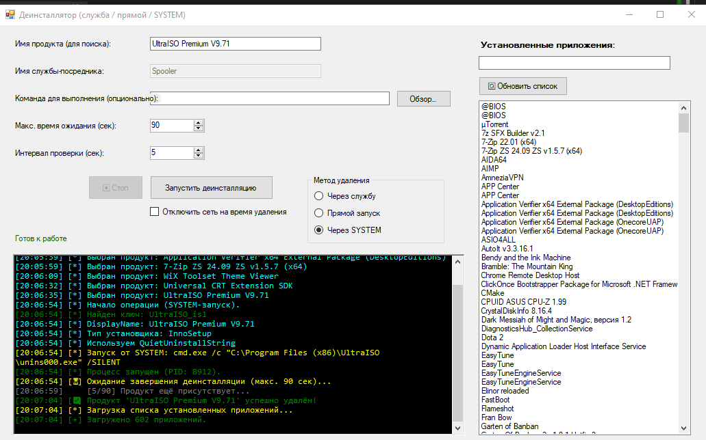

[Русская версия](README.ru.md)

# SysUninstaller

**A universal tool for forced uninstallation of programs in Windows.**

Three uninstall methods, smart update checking, registry cleanup, and full control over the process.

## Key Features

- **Three uninstall methods:**  
  `Via service` (ImagePath replacement), `Direct launch` (visible console), `Via SYSTEM` (token duplication).
- **Automatic updates** – the program checks GitHub for new releases and can download and install them automatically.
- **Instant reaction to missing uninstaller** – if the uninstaller file is not found, it immediately offers to delete the registry entry.
- **One-click removal of orphaned registry entries.**
- **"⏹ Stop" button** to interrupt stuck operations.
- **Temporary network disable** to block callback connections.
- **Detailed colorized logging** with timestamps.
- **Informative tooltips** on all UI elements and built-in help (`?`).
- **Clear explanation for non-admin users** – explains why administrator rights are needed.
- **Automatic language detection** – the interface and all messages appear in Russian or English based on the system language.

## Requirements

- Windows 7 / 8 / 10 / 11 (administrator rights)
- .NET Framework 4.5.2 or later

## Quick Start

1. Launch the program (UAC will be requested automatically).
2. Select a product from the list or enter its name manually.
3. Choose an uninstall method (default is "Direct launch").
4. Optionally adjust timeouts, disable network, or specify a custom command.
5. Click **"Start uninstall"**.
6. If a registry entry remains after uninstall – double-click it and choose **"Delete registry entry"**.

## Screenshot



## Build from Source

```bash
git clone https://github.com/kizrrum/SysUninstaller.git
Open SysUninstaller.sln in Visual Studio, build in Release configuration.
The executable will be located in bin\Release\.

Disclaimer
⚠️ Use at your own risk. The author is not responsible for any damage caused by the use of this software. You are solely responsible for compliance with all applicable laws and regulations.

text
